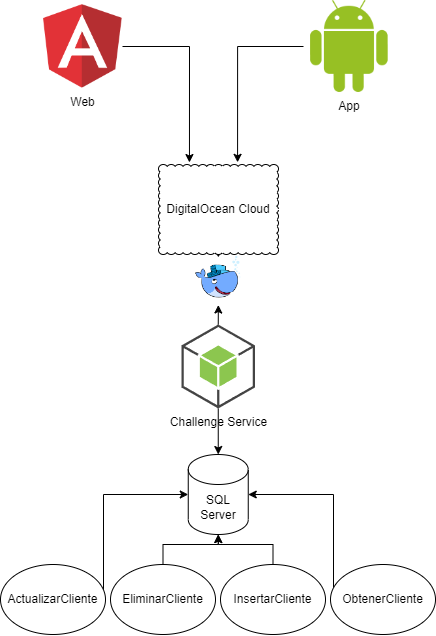

# TCC Backend Service

Esto es un proyecto para resolver el reto de clientes de TCC


## Descripción

Un microservicio que cuenta con una autenticacion, adicional de esto permite hacer todas las operaciones de un CRUD de clientes.


## Que se hizo?

Se crea un API en NodeJS con Express, utilizando TypeORM para conectarse a la base de datos SQL Server, adicionalmente se conecta con Firebase para realizar la autenticación.



***Se adjunta las historias de usuario en el archivo "historias de usuario.xlsx"***


## Correr el proyecto

Follow these steps to run the project:

1. Clone este repositorio
2. Instala docker y docker-compose en tu maquina, adicional una base de datos SQL Server
3. En el directorio del proyecto corre el siguiente comando:
```
docker-compose up
```
Va a iniciar el servicio y adicional la base de datos de SQL Server

4. Cuando ya esté arriba y corriendo, puedes hacer una petición a `http://localhost:3000/login` para iniciar sesión en la cuenta y posterior obtener el token que permite consultar el resto de endpoints.
```
Aquí hay un par de correo-contraseña que sirven para pruebas
test@test.com - 123456
test2@test.com - 654321
```


## Endpoints

__AUTH__
```
POST - http://localhost:3000/login - Endpoint to login
Body
{
    "email": "test@test.com",
    "password": "123456"
}
```

__CLIENT__
```
GET - http://localhost:3000/client/:identification?identificationType=CC - Retorna un cliente
Params
:identification
Query
identificationType
```


```
GET - http://localhost:3000/client/ - Retorna todos los clientes
```


```
POST - http://localhost:3000/client/ - Crea un cliente
Body
{
    "identification": "1039290068",
    "identificationType": "Cédula Ciudadania",
    "name": "Jhon Gil",
    "gender": "Masculino"
}
```


```
PUT - http://localhost:3000/client/ - Actualiza un cliente
Body
{
    "identification": "1039290069",
    "identificationType": "Cédula Ciudadania",
    "name": "Luz Mery Sepulveda Durango",
    "gender": "Femenino"
}
```

```
POST - http://localhost:3000/client/:identification?identificationType=CC - Elimina un cliente
Params
:identification
Query
identificationType
```

## Built with 🛠️
* [NodeJS](https://nodejs.org/)
* [Express](https://expressjs.com/)
* [InversifyJS](https://github.com/inversify/InversifyJS)
* [TypeORM](https://typeorm.io/#/)
* [Docker](https://www.docker.com/)


## Authors

* **Jhon Gil Sepulveda** - *Starter* - [rankey1496](https://github.com/rankey1496)


## License

This project is licensed under the ISC License.